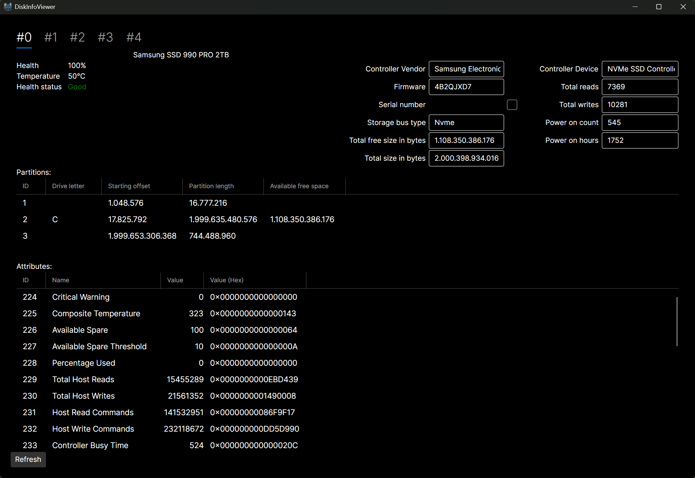
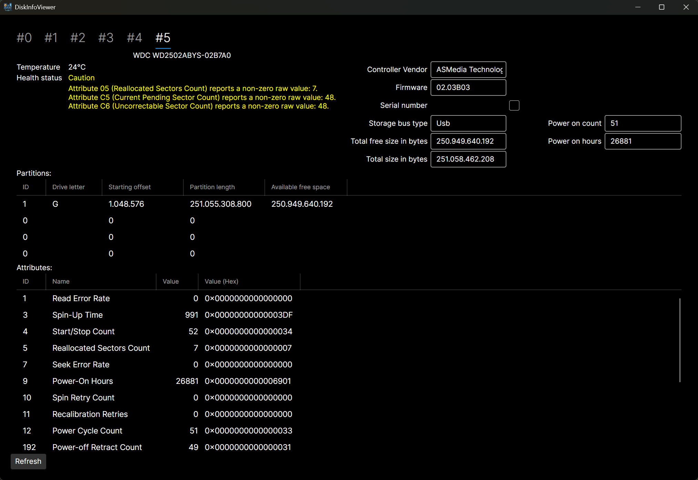

# DiskInfoToolkit
[](https://github.com/blacktempel/diskinfotoolkit/blob/master/LICENSE)
[](https://github.com/Blacktempel/DiskInfoToolkit/actions/workflows/master.yml)
[](https://www.nuget.org/packages/DiskInfoToolkit/)
[](https://www.nuget.org/packages/DiskInfoToolkit/)

A toolkit for Storage Device informations. Primarily used for reading [S.M.A.R.T.](https://en.wikipedia.org/wiki/Self-Monitoring,_Analysis_and_Reporting_Technology) data from storage devices.

## Preview of DiskInfoViewer

Please click on an image to show its full size.<br/>
Note that the screenshots may not always represent the latest version of the app.

<a href="Screenshots/DiskInfoViewer01.png">
    
</a>
<a href="Screenshots/DiskInfoViewer02.png">
    
</a>

## Project overview
| Project | .NET Version[s] |
| --- | --- |
| **[DiskInfoToolkit](https://github.com/Blacktempel/DiskInfoToolkit/tree/master/DiskInfoToolkit)** <br/> This library reads detailed information from various types of storage devices - including NVMe, SSD, HDD and USB drives. <br/> It provides a high level API to read device data, [SMART attributes](https://en.wikipedia.org/wiki/Self-Monitoring,_Analysis_and_Reporting_Technology), Partitions and other hardware details directly from the system. | .NET Framework 4.7.2 & 4.8.1 <br/> .NET Standard 2.0 <br/> .NET 8, 9 and 10 |
| **[ConsoleOutputTest](https://github.com/Blacktempel/DiskInfoToolkit/tree/master/ConsoleOutputTest)** <br/> Example Application to show how some library functionality can be used. | .NET 8 |
| **[DiskInfoViewer](https://github.com/Blacktempel/DiskInfoToolkit/tree/master/DiskInfoViewer)** <br/> Visualization of detected storage devices on your system. <br/> This supports adding / removing storage devices and updates data. <br/> UI is built using [Avalonia UI.](https://avaloniaui.net/) | .NET 8 |

## What platforms are supported ?
For the moment we only support Windows.<br/>
We are looking into supporting Linux later on.

## Where can I download it ?
You can download the latest release [from here.](https://github.com/Blacktempel/DiskInfoToolkit/releases)

## How can I help improve the project ?
Feel free to give feedback and contribute to our project !<br/>
Pull requests are welcome. Please include as much information as possible.

## Developer information
**Integrate the library in your own application**

**Sample code**
```C#
static class Program
{
    static void Main(string[] args)
    {
        //You can enable logging and set level, if you need logging output
        Logger.Instance.IsEnabled = true;
        Logger.Instance.LogLevel = LogLevel.Trace;

        //Get all storage devices
        var disks = Storage.GetDisks();

        //Go through all devices
        foreach (var disk in disks)
        {
            //Output Model of storage device
            Console.WriteLine($"Detected storage device '{disk.ProductName}' ('{disk.DisplayName}').");
        }

        //Register change event
        Storage.DevicesChanged += DevicesChanged;

        var secondsToWait = 10;

        //Wait for specified amount of time and listen to device changes
        Console.WriteLine($"Waiting {secondsToWait} seconds for device changes.");
        Thread.Sleep(TimeSpan.FromSeconds(secondsToWait));

        //Update devices once
        foreach (var disk in Storage.CurrentDisks)
        {
            //Refresh device data and output if there were changes compared to cached data
            if (Storage.Refresh(disk))
            {
                Console.WriteLine($"Refreshed - changes detected: '{disk.ProductName}' ('{disk.DisplayName}')");
            }
            else
            {
                Console.WriteLine($"Refreshed - no changes detected: '{disk.ProductName}' ('{disk.DisplayName}')");
            }
        }

        //Unregister change event
        Storage.DevicesChanged -= DevicesChanged;

        //Save log file to current directory, if you enabled logging output
        Logger.Instance.SaveToFile("Log.txt", false);

        //All done
        Console.WriteLine("Press enter to exit...");
        Console.ReadLine();
    }

    static void DevicesChanged(object sender, StorageDevicesChangedEventArgs e)
    {
        //Check if there are changes, if not we can ignore this event
        if (!e.HasChanges)
        {
            return;
        }

        //Simple output of added devices
        if (e.Added != null)
        {
            foreach (var added in e.Added)
            {
                Console.WriteLine($"Added: '{added.ProductName}' ('{added.DisplayName}')");
            }
        }

        //Simple output of removed devices
        if (e.Removed != null)
        {
            foreach (var removed in e.Removed)
            {
                Console.WriteLine($"Removed: '{removed.ProductName}' ('{removed.DisplayName}')");
            }
        }
    }
}
```

## License
DiskInfoToolkit is free and open source software licensed under MPL 2.0.<br/>
You can use it in private and commercial projects.<br/>
Keep in mind that you must include a copy of the license in your project.